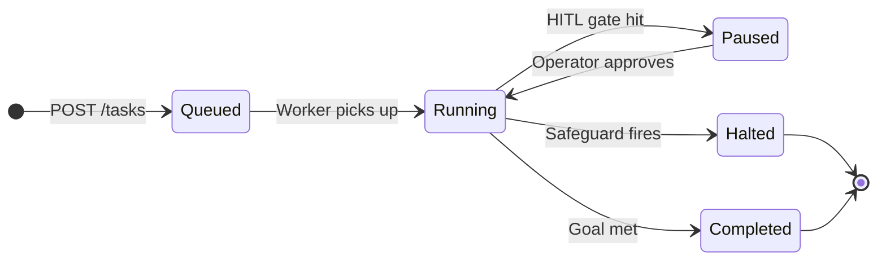

# Agents and tasks

If you've used any agent framework, this page will mostly map terms you already know to LegionForge's conventions. If you haven't, this page is the right starting point.

## What an agent is

An **agent** in LegionForge is a [LangGraph](https://github.com/langchain-ai/langgraph) state machine that:

- Receives a prompt and some context
- Plans the next step (usually a tool call)
- Executes the tool (after security checks)
- Integrates the result
- Repeats until the goal is met or a safeguard halts it

The agent isn't the LLM. The agent is the **graph + the state + the safeguards + the tools**. The LLM is one component, called from one node.

This distinction matters because LegionForge wraps the LLM. The LLM never directly calls a tool — the framework dispatches tools based on the LLM's output, after Guardian's checks pass.

## What a task is

A **task** is one unit of work submitted to LegionForge. It carries:

| Field | What it is |
|---|---|
| `prompt` | The user's request in natural language |
| `user_id` | Who submitted it (looked up from the Bearer token) |
| `capability_scope` | What this task is allowed to do (e.g., `["read", "fetch:web", "summarize"]`) |
| `token_budget` | How many tokens this task may use, total |
| `options` | Per-task overrides — model, tracing on/off, etc. |

A task has a unique ID and is checkpointed at every step, so it can be paused (for HITL approval) and resumed later — even after a process restart.

## The lifecycle

A task can be in five states:

- **Queued** — submitted, waiting for a worker
- **Running** — actively executing
- **Paused** — waiting for human approval (HITL)
- **Halted** — stopped by a safeguard (loop, budget, security violation)
- **Completed** — produced a result

All states are persisted to PostgreSQL. A crash in the middle doesn't lose the task; resumption picks up from the last checkpoint.

## How an agent gets work done

A simplified picture of one task running:

1. **Sanitize input.** The user's prompt passes through `sanitize_input()`, which runs 29 prompt-injection patterns over it. Anything matching Tier 1 is rejected immediately.
2. **Plan.** The orchestrator LLM is called with the prompt + available tools. It returns a `tool_calls` block.
3. **Guard.** For each tool call, the framework POSTs to Guardian. Guardian runs 7 checks and returns allow or deny.
4. **Execute.** Allowed tools are invoked. The result comes back as a `ToolMessage`.
5. **Integrate.** Result + history go back to the LLM. Step 2 again.
6. **Loop until done** — bounded by step counter, action-history hash, and token budget.
7. **Verify.** A `verify_node` re-checks the final answer once. May re-prompt the LLM (max 1 round).
8. **Sanitize output.** Strip PII before returning. Log to `audit_log` and `threat_events` (async).
9. **Stream.** SSE events go back to the user as the steps happen.

## What you don't have to write

LegionForge gives you the orchestrator, the safeguards, the LLM factory, the tool wrapper, and Guardian for free. What you typically write:

- **Tools** — Python functions, decorated, registered with the framework. The framework handles signing and dispatch.
- **A starter prompt / system prompt** — for the orchestrator if you want a custom persona.
- **A capability scope** — what your task is allowed to do.

You usually don't write the agent graph itself. `src/base_graph.py` is the template; copy it if you need a custom flow, but the default is good for most tasks.

## What this is *not*

Some patterns from other frameworks **don't** apply to LegionForge:

- There's no "agent has memory of past conversations" by default. State persists per-task, not per-agent-identity. Use [Jeli](https://github.com/LegionForge/jeli) for cross-task memory.
- There's no "agent shells out to a model and parses the response." Tool calling is structured (`tool_calls`), not text-parsed.
- There's no "agent runs forever in a loop." Three independent safeguards make that impossible.
- There's no "if the LLM doesn't return a tool call, fall back to text." If `tool_choice=required` is set and the LLM ignores it (some models do), the framework retries with a stronger prompt, then falls back to a deterministic default — not free-form text generation.

## What's next

- **[Tools and capabilities](tools-and-capabilities.md)** — what a tool looks like, how capability scope works
- **[Security fundamentals](security-fundamentals.md)** — trust boundaries and why the LLM is not trusted
- **[Framework → Architecture](../framework/architecture.md)** — the technical layout of all this
