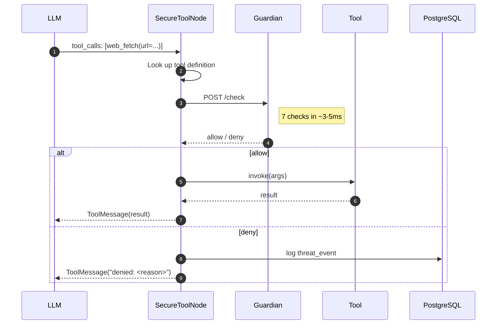

# Tools and capabilities

Tools are the **actions** an agent can take in the outside world. Capabilities are the **authorization** to take them.

In LegionForge, tools are first-class citizens with strong guarantees: every tool is registered, signed, hashed, and capability-scoped. The LLM can ask to call a tool, but it cannot *cause* a tool to run — only the framework dispatcher can, and only after Guardian agrees.

## What a tool looks like

A LegionForge tool is a Python function with a decorator:

```python
from src.security import tool, Capability

@tool(
    name="web_fetch",
    description="Fetch the contents of a URL. Returns the text body.",
    required_capability=Capability.FETCH_WEB,
)
async def web_fetch(url: str) -> str:
    async with httpx.AsyncClient(timeout=10) as client:
        response = await client.get(url)
        response.raise_for_status()
        return response.text
```

The decorator does several things at registration time:

1. **Names** the tool so the LLM can reference it
2. **Validates** the type hints — the framework derives the JSON schema for `tool_calls` from these
3. **Hashes** the source code of the function
4. **Signs** the hash with the Ed25519 private key (`legionforge_tool_signer` in Keychain)
5. **Records** the required capability so Guardian can check it later

The hash + signature go into the `tool_registry` table. From this point on, the tool can be invoked through the framework.

## What a capability is

A **capability** is a small string that names a class of action:

| Capability | What it authorizes |
|---|---|
| `READ` | Read-only operations against local resources |
| `WRITE` | Mutating operations against local resources (file system, etc.) |
| `FETCH_WEB` | HTTP requests to external URLs |
| `EXEC_SHELL_SAFE` | Shell commands in a restricted allowlist |
| `EXEC_SHELL_FULL` | Arbitrary shell commands |
| `DB_READ` | Database read queries |
| `DB_WRITE` | Database mutations |
| `SEND_EMAIL` | Sending email |
| `POST_SLACK` | Posting to Slack |

Capabilities are a finite set defined in the framework. They're not arbitrary strings. Custom capabilities can be added but they're enumerated, not free-form.

## What capability scope is

Every task carries a **capability scope** — an array of capabilities it's authorized to use:

```json
{
  "prompt": "Summarize the README at https://example.com/repo",
  "options": {
    "capability_scope": ["READ", "FETCH_WEB", "SUMMARIZE"]
  }
}
```

Scope is set at task submission. **It never widens during execution.** An agent can't decide mid-task "I need to also write files now." If it tries to call a `WRITE`-requiring tool, Guardian denies it.

This is the layer that catches **capability creep** — the "give me capability X just for this one thing" sliding-scale failure mode common in less-guarded frameworks.

## Why tools are signed

The signing pipeline catches a specific attack: a compromised dependency replacing a registered tool's code.

Without signing, the flow is:

1. You register `web_fetch` from the `tools.web` module
2. A malicious package update to `httpx` replaces it with `compromised_fetch` at import time
3. The framework now happily invokes the compromised version

With Ed25519 signing:

1. You register `web_fetch` → its hash is stored along with a signature
2. Malicious dep replaces the function → the live code hash no longer matches
3. Guardian's hash check fails → the call is denied

This catches the supply-chain attack at invocation time, not at install time. The private signing key never leaves Keychain.

## How tool calls actually execute

When an agent's LLM returns a `tool_calls` block, the framework's `SecureToolNode` wraps each call:



A denied call doesn't crash the agent. The LLM gets back a `ToolMessage` saying the call was denied with a reason. It can choose to do something else — or fail gracefully — based on the reason.

## How a tool gets retired

Tools can be revoked without redeploying code:

```sql
INSERT INTO revoked_tools (tool_id, reason)
VALUES ('web_fetch', 'CVE-2026-XXXX: SSRF via redirect handling');
```

Guardian's rule cache picks up the new entry within 10 seconds. Every subsequent call to `web_fetch` is denied with `tool_revoked: <reason>`.

This is the "kill switch" for the supply chain: when a dep is announced as vulnerable, you don't have to push a hotfix to every running agent. You revoke the tool, the cache reloads, and the tool stops being callable everywhere.

## What's next

- **[Security fundamentals](security-fundamentals.md)** — trust boundaries and the deterministic-checks thesis
- **[Guardian → Checks](../guardian/checks.md)** — full detail on each of the 7 checks Guardian runs
- **[Framework → Threat Events](../framework/threat-events.md)** — every event that fires when a tool call is blocked
