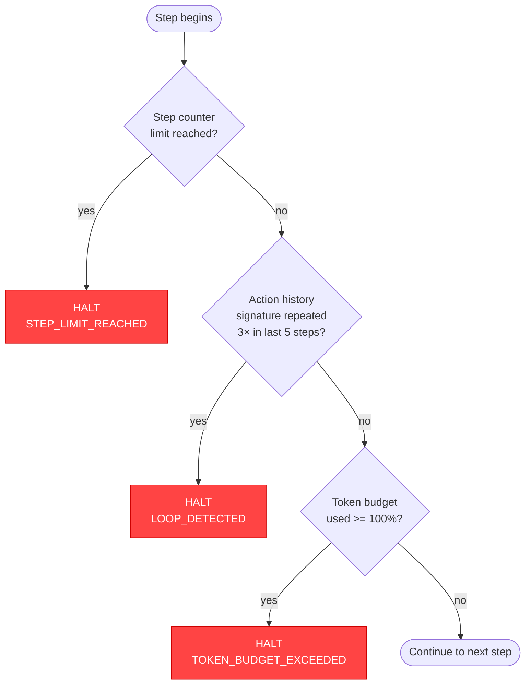
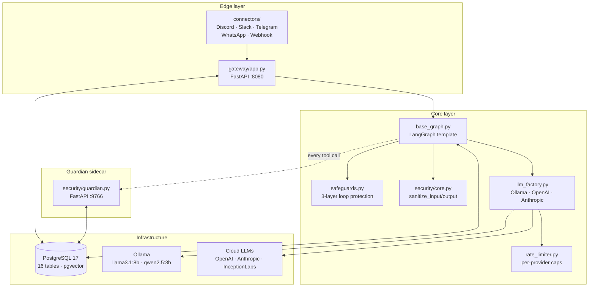
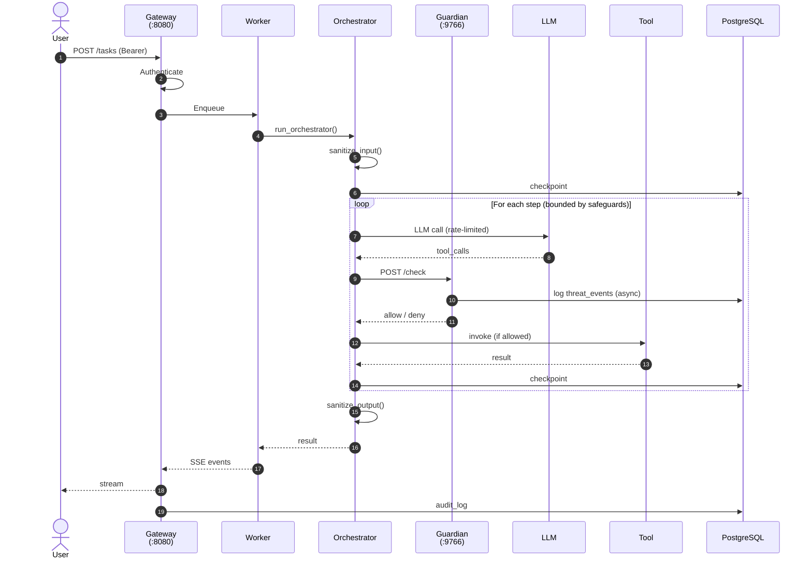

# Architecture

## Core design principles

LegionForge is built around five non-negotiable principles. Every module and every code path is shaped by them:

| Principle | What it means in practice |
|---|---|
| **Fail-safe tiering** | Halt → sandbox/retry → degrade. Never silently succeed. Errors propagate with intent. |
| **Human gates on all mutations** | Destructive actions cross a human-in-the-loop boundary by default. |
| **Replace AI with determinism wherever possible** | The LLM is the last resort, not the first. Rules, tables, and pattern matchers run ahead of model calls. |
| **Validate at trust boundaries, not at processing nodes** | Sanitize once, at the edge. Internal code trusts internal data. |
| **Privilege tied to tasks, not persistent to agents** | Capability is scoped to the active task and expires when the task ends. |

## Key modules

| Module | Responsibility |
|---|---|
| `config/settings.py` | Pydantic singleton loaded from a hardware YAML profile. All memory limits, model names, safeguard thresholds, and paths come from here. |
| `src/base_graph.py` | LangGraph template. Copy this when creating new agents. Wires in three-layer loop protection, token budgeting, per-run tracing toggle, TOCTOU snapshot, and Guardian pre-invocation check automatically. |
| `src/security/core.py` | API key management via macOS Keychain (no `.env` secrets), prompt-injection detection (29 patterns, Tier 1/2 tiering), PII redaction. All inputs pass through `sanitize_input()`; all outputs through `sanitize_output()`. |
| `src/security/guardian.py` | Guardian FastAPI sidecar on port 9766. See [Guardian](../guardian/index.md). |
| `src/safeguards.py` | Three independent loop-protection layers. |
| `src/database.py` | Async PostgreSQL pool (admin + restricted app roles), LangGraph `AsyncPostgresSaver` for checkpoint resumption, pgvector RAG, 16 tables. |
| `src/llm_factory.py` | Unified factory for Ollama, OpenAI, Anthropic, InceptionLabs. Reads config from the hardware profile. Supports cloud fallback. |
| `src/rate_limiter.py` | Per-provider rate limits with pre-execution token cost estimation. Hard daily caps with 80% / 100% alert thresholds. |
| `src/gateway/app.py` | FastAPI gateway on port 8080. Task submission queue, SSE streaming, web UI, A2A + MCP endpoints, Bearer auth. |
| `src/connectors/discord.py` | Discord bot connector. Bridges `!<task>` messages → gateway → SSE stream → reply edits. (And similar for Telegram, Slack, WhatsApp.) |

## Three independent loop-protection layers

A single failure shouldn't let an agent spin forever. Three independent layers must all pass on every step. If any one fires, execution halts and a threat event is logged.

| Layer | Mechanism | Threshold |
|---|---|---|
| **Step counter** | LangGraph recursion limit | Hard stop on N steps |
| **Action-history** | MD5 hash of the last 5 tool-call signatures | Same signature 3× → halt |
| **Token budget** | Cumulative per-task token usage | Alert at 80%, force-end at 100% |

See [Threat Events](threat-events.md) for the corresponding event types.

## Module map

## Request flow

A task submitted to the gateway flows through gateway → worker → orchestrator → Guardian → LLM → tools → response, with checkpoints written along the way so a paused task can be resumed.

The orchestrator never trusts the LLM. Every tool call passes through Guardian; every input and output crosses a sanitization boundary; every step is checkpointed so a failure mid-task is recoverable.

## Infrastructure dependencies

| Component | Purpose |
|---|---|
| **PostgreSQL 17** | Database: `legionforge`. Password in macOS Keychain (`service: postgres`). |
| **Ollama** | Local LLM runtime. Primary: `llama3.1:8b`. Router: `qwen2.5:3b`. Embeddings: `mxbai-embed-large`. |
| **Docker Desktop** | Required for Guardian sidecar. |
| **macOS Keychain** | All secrets. Never `.env` for production keys. |

## Phase status

- **Phases 0–16** — Full security stack, multi-user gateway, integration tests, modular auth, containerized gateway, multi-provider auth registry, Redis-backed state layer, Kerberos GSSAPI backend, multi-instance docker-compose, Redis global budget counters, Prometheus /metrics endpoint, request trace ID middleware, polished web UI, Telegram/Slack/Webhook channel connectors.
- **Phases 60–381 + G1–G4 + H + I + J + HITL** — 381-tool operator dashboard, web_fetch_js headless browser, Guardian G1–G4 (PyPI published, public repo live, auto-sync Action), agent memory, dual license (AGPL-3.0 + commercial), session continuity UI, multi-modal image input, HITL approval gate, WhatsApp connector.

Current test baseline:

| Suite | Count |
|---|---|
| Smoke | 2247 |
| Integration | 38 |
| Kerberos live-KDC | 5 |
| UI (Playwright) | 40 |
| TestLab | 104 |
| Tool accuracy | 79 |
| Crystallization | 114 |
