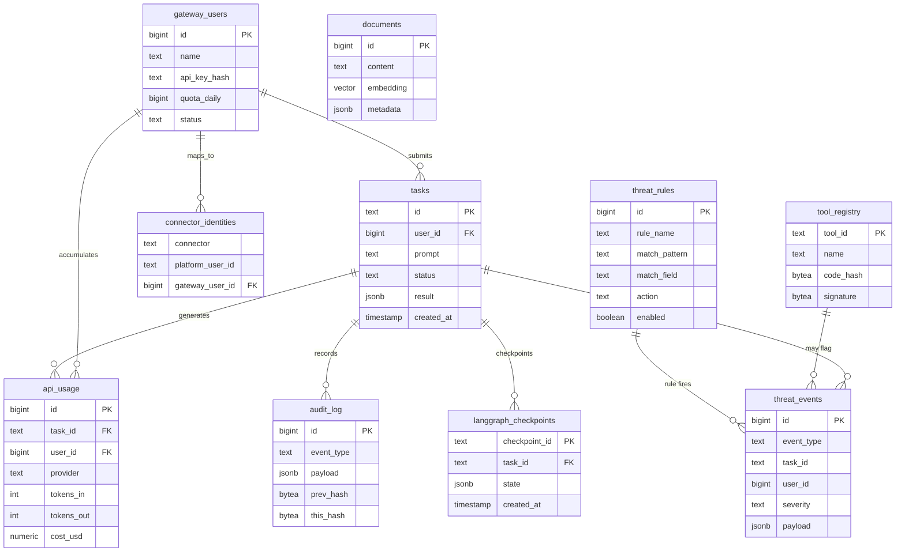

# Database

LegionForge uses **PostgreSQL 17** with `pgvector` for the RAG layer and `AsyncPostgresSaver` for LangGraph checkpoints. The schema is split across 16 tables and uses **role-based access** so that a compromised component can't escalate.

## Role model

Five roles, each with the minimum necessary privileges:

| Role | What can it do |
|---|---|
| `legionforge_admin` | Superuser. Migrations, DDL, table creation. Not used at runtime. |
| `legionforge_gateway` | Read + write on user-facing tables (`gateway_users`, `tasks`, `api_usage`). |
| `legionforge_worker` | Read on `gateway_users` (for auth lookup), read + write on agent state. |
| `legionforge_guardian` | Read on `tool_registry`, read + write on `threat_rules`, `threat_events`. |
| `legionforge_readonly` | Read-only across everything. For dashboards and analytics. |

Each role's password is in macOS Keychain under `service=<role>, account=api_key`.

## Key tables

| Table | Purpose |
|---|---|
| `gateway_users` | User accounts. API key hash, quota, status. |
| `tasks` | Task submissions, status, result. |
| `api_usage` | Per-task token + cost accounting. Powers rate limiting. |
| `health_metrics` | Time-series health data (CPU, RAM, GPU, Ollama state). |
| `documents` | RAG corpus. 768-dim embeddings, HNSW index. |
| `threat_events` | Structured security events. See [Threat Events](threat-events.md). |
| `audit_log` | Append-only event log with SHA-256 hash chain. |
| `threat_rules` | Adaptive Guardian rules. Hot-reloaded every 10 s. |
| `tool_registry` | Registered tools with Ed25519 signatures. |
| `langgraph_checkpoints` | LangGraph's `AsyncPostgresSaver` state. |



## RAG with pgvector

The `documents` table stores text chunks with 768-dimensional embeddings (produced by `mxbai-embed-large`). It uses an HNSW index for fast approximate nearest-neighbor search:

```sql
CREATE INDEX documents_embedding_hnsw_idx
  ON documents USING hnsw (embedding vector_cosine_ops);
```

Query pattern from the framework:

```python
results = await db.fetch("""
    SELECT id, content, 1 - (embedding <=> $1) AS similarity
    FROM documents
    ORDER BY embedding <=> $1
    LIMIT 5
""", query_embedding)
```

## LangGraph checkpoints

`AsyncPostgresSaver` writes graph state to `langgraph_checkpoints` after every node. A task can be paused (for HITL approval) and resumed because every step is checkpointed.

The checkpoint table is large (one row per graph step per task) and rotates older entries based on `audit_log_retention_days` in the hardware profile.

## Audit hash chain

`audit_log` is append-only and uses a SHA-256 hash chain:

```sql
CREATE TABLE audit_log (
    id BIGSERIAL PRIMARY KEY,
    timestamp TIMESTAMPTZ NOT NULL DEFAULT now(),
    event_type TEXT NOT NULL,
    payload JSONB NOT NULL,
    prev_hash BYTEA,
    this_hash BYTEA NOT NULL
);
```

Each row's `this_hash = SHA256(prev_hash || event_type || payload || timestamp)`. Tampering with any row breaks the chain at every subsequent row, which is detectable in a single pass.

## Initialization

```bash
make db-init     # one-time: create database, roles, tables, extensions
make db-start    # start PostgreSQL service
```

`db-init` is idempotent. Running it twice is safe.

## Connection pools

The framework holds **three separate** asyncpg pools:

```python
admin_pool      # legionforge_admin   — used only by migrations
gateway_pool    # legionforge_gateway — used by FastAPI gateway
worker_pool     # legionforge_worker  — used by agent workers
```

Routing by pool enforces the role separation at the connection layer, not just at SQL grant time. Trying to insert into `gateway_users` from a worker fails because the worker pool's role has no INSERT privilege there.

## Common operations

??? note "Reset Guardian role password"

    ```bash
    psql -U legionforge_admin -d legionforge -c \
      "ALTER ROLE legionforge_guardian WITH PASSWORD 'newpassword';"

    security add-generic-password -A \
      -s legionforge_guardian -a api_key -w 'newpassword'
    ```

??? note "Inspect threat events"

    ```sql
    SELECT event_type, COUNT(*)
    FROM threat_events
    WHERE timestamp > now() - interval '7 days'
    GROUP BY event_type
    ORDER BY COUNT(*) DESC;
    ```

??? note "Verify audit-chain integrity"

    Use the `make audit-verify` target — it walks the chain and reports any broken links.
