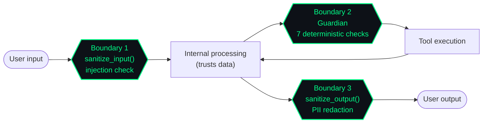

# Security Model

LegionForge's security model is built on a simple thesis: **the LLM is not trustworthy**. Everything that crosses a trust boundary is validated by deterministic code before the LLM ever sees it, and everything the LLM produces is validated again before it has any effect.

## Trust boundaries

There are three boundaries in the system. Each is the only place validation should happen:

Validating at processing nodes is a footgun: every node has to know about every threat, and a missed validation means the threat slips through. Validating at boundaries means there are exactly three places to audit.

## The security stack

| Layer | What it does | Where it lives |
|---|---|---|
| **Input sanitization** | Prompt-injection detection (29 patterns, Tier 1/2 tiering), PII redaction | `src/security/core.py` |
| **Output sanitization** | Strips secrets and PII before logging to LangSmith or returning to user | `src/security/core.py` |
| **Tool signing** | Every registered tool has an Ed25519 signature; the signature is verified before invocation | `src/security/` |
| **Guardian (sidecar)** | 7-check pipeline on every tool call. See [Guardian](../guardian/index.md). | `src/security/guardian.py` + Docker container |
| **Loop protection** | Three independent layers — step counter, action-history hash, token budget | `src/safeguards.py` |
| **Rate limiting** | Per-provider hard caps with pre-execution cost estimation | `src/rate_limiter.py` |
| **HITL approval gate** | Destructive tool calls cross a human-in-the-loop approval | `src/gateway/` + web UI |
| **Audit chain** | Every event logged to `audit_log` with SHA-256 hash chain | `src/database.py` |

## Prompt-injection detection

`sanitize_input()` runs every incoming string through a regex-based detector with 29 patterns split into two tiers:

- **Tier 1** — high-confidence patterns. Match → reject immediately, log `INJECTION_DETECTED`.
- **Tier 2** — heuristic patterns. Match → flag for review, downgrade trust on that input.

The detector is deterministic. No LLM is in the hot path. Adding patterns is an append-only operation.

## Tool signing

Every tool registered with the framework has an Ed25519 signature stored in PostgreSQL. The signing key lives in macOS Keychain as `legionforge_tool_signer` and is injected as an env var at startup.

On every tool invocation:

1. The framework looks up the tool's stored hash and signature
2. Verifies the signature with the public key
3. Hashes the loaded tool code and compares to the stored hash
4. Mismatch → halt with `TOOL_HASH_MISMATCH` threat event

This catches supply-chain attacks where a dependency is replaced after registration.

## Guardian sidecar

Guardian is a separate FastAPI service (port 9766) that runs in a Docker container. It performs 7 deterministic checks on every tool invocation in under 5 ms:

1. Tool revocation list
2. Hash validation
3. Capability boundary
4. Destructive pattern detection
5. Sequence contracts
6. Ed25519 signature verification
7. Adaptive threat rules (hot-reload every 10 s from `threat_rules` table)

Guardian is the **only** component that can authorize a tool call. The framework calls Guardian; Guardian responds approve / deny.

See [Guardian](../guardian/index.md) for the full design.

## Loop protection

Three layers, independent of each other:

| Layer | Trigger | Threat event |
|---|---|---|
| Step counter | LangGraph recursion limit exceeded | `STEP_LIMIT_REACHED` |
| Action-history hash | Same tool-call signature seen 3 times in last 5 steps | `LOOP_DETECTED` |
| Token budget | Exceeded the per-task token budget | `TOKEN_BUDGET_EXCEEDED` |

A single malfunction shouldn't loop forever. All three must pass for execution to continue.

## HITL approval gate

The framework classifies tool calls as **read** or **mutate**. Mutate operations (sending email, deleting files, posting to Slack, etc.) require explicit human approval through the web UI before execution.

The approval flow:

1. Agent decides to call a mutating tool
2. Gateway pauses the task, emits an SSE event with the proposed action
3. Web UI displays the proposed action with full context
4. Human clicks approve or deny
5. Gateway resumes the task with the decision

Approval is logged in `audit_log` with the human user ID.

## Audit chain

Every meaningful event — task submission, LLM call, tool call, threat event, approval — is written to `audit_log` with a SHA-256 hash chain. Each row's `prev_hash` field is the SHA-256 of the previous row's content. Tampering with any row breaks the chain.

This isn't blockchain-grade tamper-proofing (it's just a hash chain), but it's enough to detect after-the-fact rewriting and to give compliance auditors a verifiable trail.

## What this catches — and what it doesn't

LegionForge's security model is designed for these threats:

- :material-check: Prompt injection from user input or tool output
- :material-check: Tool poisoning (compromised dependency replacing a tool's code)
- :material-check: Capability creep (agent calling a tool outside its task scope)
- :material-check: Runaway behavior (infinite loops, token bombs)
- :material-check: PII leakage in logs and traces
- :material-check: Unauthorized destructive operations

It is **not** designed for:

- :material-close: Defending against a malicious *human* operator who has gateway credentials. Bearer auth gates entry; access control inside the gateway assumes the operator is authorized.
- :material-close: Side-channel attacks on local LLM weights (model integrity is checked at load, but not at every inference).
- :material-close: Physical access to the machine.

For a deeper look at any of these, see [Guardian → Architecture](../guardian/architecture.md) and [Threat Events](threat-events.md).
