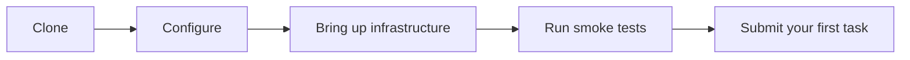
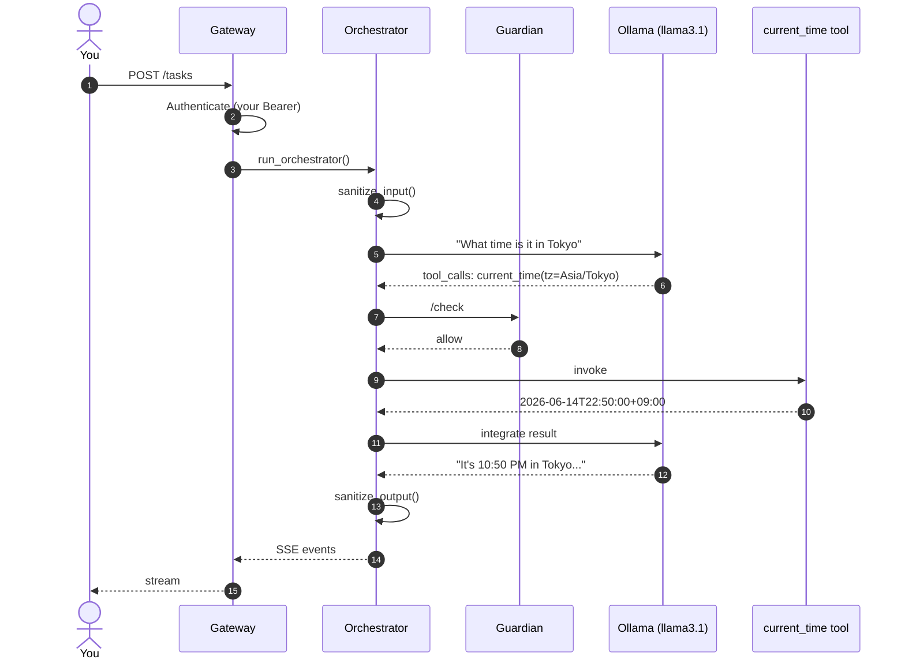

# Quickstart

A short, honest path from zero to a running LegionForge agent. Intended for users who already have Python 3.11, PostgreSQL 17, and Ollama installed and want to skip the long install walkthrough.

!!! tip "If those prerequisites are not installed"
    Use the full [Framework → Getting Started](framework/getting-started.md) walkthrough instead — it covers pyenv, Homebrew PostgreSQL, Ollama, and Docker Desktop installation step by step.

!!! warning "Pre-release"
    LegionForge is at v0.7.1-alpha and in UAT before the v0.8.0 public release. The source repository is being prepared for public availability; until then, replace `git clone` below with whatever access you have.

## What you'll do



Five steps, two terminals open at the end (gateway + your task client).

## Step 1 — Clone and install

```bash
git clone https://github.com/LegionForge/LegionForge.git
cd LegionForge

# Python 3.11 venv
pyenv local 3.11.15
python3 -m venv venv
source venv/bin/activate
pip install -r requirements.txt
```

## Step 2 — Configure the hardware profile

```bash
export AGENT_HARDWARE_PROFILE=mac_m4_mini_16gb
```

This selects `config/hardware_profiles/mac_m4_mini_16gb.yaml`. Profile picks the LLM models, memory budgets, and safeguard thresholds. Other profiles live in the same directory.

## Step 3 — Store the secrets you'll need

LegionForge reads secrets from macOS Keychain. The minimum to bring up the gateway:

```bash
# PostgreSQL admin password (must already match your local DB)
security add-generic-password -A -s postgres -a api_key -w "<your-postgres-password>"

# Guardian PostgreSQL role password (any strong string; you'll bind it to the DB role in Step 4)
security add-generic-password -A -s legionforge_guardian -a api_key -w "<guardian-role-password>"

# JWT signing secret for task tokens
security add-generic-password -A -s legionforge_task_tokens -a api_key -w "$(openssl rand -hex 32)"
```

The `-A` flag is critical — it makes the key readable by background processes. Without it, the gateway can't find the keys when launched from a non-interactive shell.

## Step 4 — Initialize the database

```bash
make db-init     # creates legionforge database, roles, tables, extensions
make db-start    # ensures PostgreSQL is up
```

`db-init` is idempotent. Run it twice if you're not sure.

## Step 5 — Pull the LLMs

```bash
ollama pull llama3.1:8b           # primary
ollama pull qwen2.5:3b            # router (smaller, faster decisions)
ollama pull mxbai-embed-large     # embeddings for RAG
```

These are ~5 GB + 2 GB + 700 MB. On a slow connection this is the longest single step.

## Step 6 — Bring up everything and run the smoke tests

```bash
make check       # verifies drive, venv, models, config
make start       # full startup: Ollama warmup + DB checks + readiness
make test-smoke  # ~21 seconds, 2247 tests, no external services
```

Expected at v0.7.1-alpha: **2247 passing**.

## Step 7 — Start the gateway

```bash
make gateway-start
```

The gateway listens on `localhost:8080`. Web UI at <http://localhost:8080/>, API at <http://localhost:8080/tasks>.

## Step 8 — Send your first task

Create a user account and grab the API key:

```bash
make create-user USER=quickstart QUOTA_DAILY=100000
```

The CLI prints the unhashed key once. Save it.

Now send a task:

```bash
curl -X POST http://localhost:8080/tasks \
  -H "Authorization: Bearer <your-key>" \
  -H "Content-Type: application/json" \
  -d '{"prompt": "What time is it in Tokyo right now?"}'
```

You'll get back a `task_id` and a `stream_url`. Subscribe to the stream:

```bash
curl -N -H "Authorization: Bearer <your-key>" \
  http://localhost:8080/tasks/<task_id>/stream
```

You'll see SSE events:

```
event: tool_call
data: {"tool": "current_time", "args": {"timezone": "Asia/Tokyo"}}

event: tool_result
data: {"tool": "current_time", "result": "2026-06-14T22:50:00+09:00"}

event: message
data: {"role": "assistant", "content": "It's 10:50 PM..."}

event: done
data: {"status": "completed", "tokens": 642}
```

That's your first agent run end-to-end.

## What just happened under the hood



Every step you can see — every step the framework knows about — passed through sanitization, Guardian, and the audit log. Run the same task once, then check:

```sql
SELECT event_type, COUNT(*)
FROM threat_events
WHERE task_id = '<task_id>';
```

If everything went smoothly, you'll get 0 rows. The interesting case is when something *does* get blocked.

## Try something that should be blocked

Send a task that tries to use a capability your scope doesn't grant:

```bash
curl -X POST http://localhost:8080/tasks \
  -H "Authorization: Bearer <your-key>" \
  -H "Content-Type: application/json" \
  -d '{
    "prompt": "Delete the file /tmp/test.txt for me",
    "options": {"capability_scope": ["READ"]}
  }'
```

The agent will try to call `delete_file` (which requires `WRITE`), Guardian will deny it, and the response will explain that the action was outside the task's authorized scope. Check `threat_events`:

```sql
SELECT event_type, payload
FROM threat_events
ORDER BY id DESC LIMIT 1;
```

You should see `GUARDIAN_DENIED` with `payload.check_name = "capability_boundary"`.

## Next steps

- [Concepts](concepts/index.md) — get the mental model
- [Framework → Architecture](framework/architecture.md) — go deeper
- [Connectors](framework/connectors.md) — wire LegionForge into Discord, Slack, etc.
- [Guardian](guardian/index.md) — understand what the sidecar is doing
